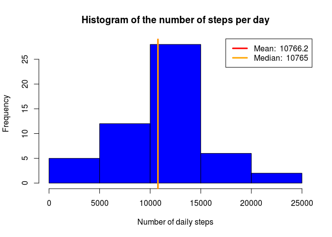
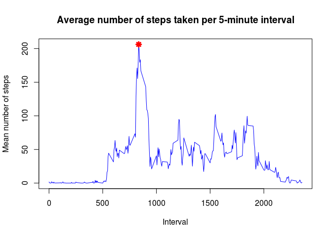
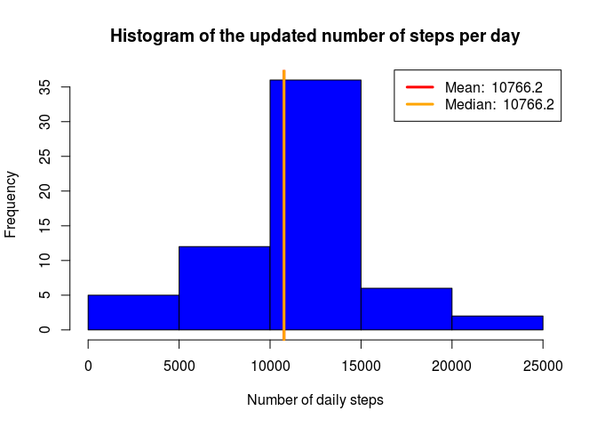
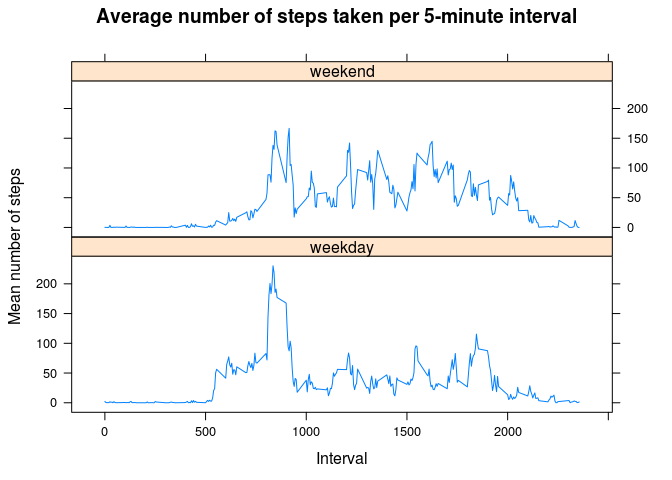

# Reproducible Research Assignment: Course Project 1

## Initialization


```r
library(lattice)
library(knitr)

opts_chunk$set(echo=TRUE) # Set global options

datetime <- Sys.time()
date <- format(datetime, "%Y-%m-%d")
time <- format(datetime, "%H:%M:%S")
Rversion <- version$version.string
```
 
This document has been generated on 2016-10-23 at 23:17:53 using R version 3.2.3 (2015-12-10)

## Loading and preprocessing the data

- First load the data 


```r
activity <- read.csv("activity.csv", header = TRUE, sep = ",")
```

- Observe the data structure


```r
names(activity)
```

```
## [1] "steps"    "date"     "interval"
```

```r
head(activity)
```

```
##   steps       date interval
## 1    NA 2012-10-01        0
## 2    NA 2012-10-01        5
## 3    NA 2012-10-01       10
## 4    NA 2012-10-01       15
## 5    NA 2012-10-01       20
## 6    NA 2012-10-01       25
```

```r
str(activity)
```

```
## 'data.frame':	17568 obs. of  3 variables:
##  $ steps   : int  NA NA NA NA NA NA NA NA NA NA ...
##  $ date    : Factor w/ 61 levels "2012-10-01","2012-10-02",..: 1 1 1 1 1 1 1 1 1 1 ...
##  $ interval: int  0 5 10 15 20 25 30 35 40 45 ...
```

- In the following it will be more suitable to deal with date as "R Date"


```r
activity$date <- as.Date(activity$date, format = "%Y-%m-%d")
```

## What is the mean total number of steps taken per day ?

- Compute the total number of steps per day thanks to the "aggregate" function


```r
stepsperday <- aggregate(steps ~ date, data = activity, FUN = sum, na.rm = TRUE)
```

- Make a histogram of the total number of steps taken each day, then compute the mean and median of this last quantity  


```r
xlabel1 <- "Number of daily steps"
title1 <- "Histogram of the number of steps per day"
hist(stepsperday$steps, breaks = 5, col = "blue", xlab = xlabel1, main = title1)
meanstepsperday <- round(mean(stepsperday$steps), 1)
medianstepsperday <- round(median(stepsperday$steps), 1)
abline(v = meanstepsperday, lwd = 3, col = "red")
abline(v = medianstepsperday, lwd = 3, col = "orange")
meanlabel <- paste("Mean: ", meanstepsperday)
medianlabel <- paste("Median: ", medianstepsperday)
legend("topright", lty = 1, lwd = 3, col = c("red", "orange"), 
       legend = c(meanlabel, medianlabel))
```

<!-- -->

Observe that the mean and median total number of steps taken per day are respectively equal to 1.07662\times 10^{4} and 1.0765\times 10^{4} so that those two values are indistinguishable on the previous plot.

## What is the average daily activity pattern ?

- Compute the average number of steps taken per 5-minute interval thanks to the "aggregate" function


```r
stepsperinterval <- aggregate(steps ~ interval, data = activity, FUN = mean, 
                              na.rm = TRUE)
```

- Look for the maximum average number of steps per 5-minute interval in the previous dataset


```r
maxstepsperinterval <- round(stepsperinterval[which.max(stepsperinterval$steps), ], 1)
```

- Make a time series plot (i.e. type = "l") of the 5-minute interval (x-axis) and the average number of steps taken, averaged across all days (y-axis)


```r
xlabel2 <- "Interval"
ylabel2 <- "Mean number of steps"
title2 <- "Average number of steps taken per 5-minute interval"
with(stepsperinterval, plot(x = interval, y = steps, type = "l", col = "blue", 
                            xlab = xlabel2, ylab = ylabel2, main = title2))
with(maxstepsperinterval, points(x = interval, y = steps, col = "red", lwd = 3, 
                                 pch = 8))
```

<!-- -->

On the previous plot, the red point indicates the coordinates of the maximum average number of steps per 5-minute interval, namely an average value of 206.2 steps associated with the 835th interval. 

## Imputing missing values

- Calculate and report the total number of missing values in the dataset (i.e. the total number of rows with NAs)


```r
nbmissingvalues <- sum(is.na(activity$steps))
```

There are 2304 missing values in the original dataset. The following function will be helpful to fill in those missing values.


```r
replaceNA <- function(value, replacement){
    if(is.na(value)){
        return(replacement)
    }
    return(value)
}
```

- In the following each missing value is filled in with the average number of steps over the corresponding interval  


```r
newactivity <- activity
newactivity$steps <- mapply(replaceNA, newactivity$steps, stepsperinterval$steps)
```

- Check the new dataset


```r
head(newactivity)
```

```
##       steps       date interval
## 1 1.7169811 2012-10-01        0
## 2 0.3396226 2012-10-01        5
## 3 0.1320755 2012-10-01       10
## 4 0.1509434 2012-10-01       15
## 5 0.0754717 2012-10-01       20
## 6 2.0943396 2012-10-01       25
```

- Compute the updated total number of steps per day thanks to the "aggregate" function


```r
newstepsperday <- aggregate(steps ~ date, data = newactivity, FUN = sum)
```

- Make a histogram of the total number of steps taken each day, then compute the mean and median of this last quantity  


```r
xlabel3 <- "Number of daily steps"
title3 <- "Histogram of the updated number of steps per day"
hist(newstepsperday$steps, breaks = 5, col = "blue", xlab = xlabel3, main = title3)
newmeanstepsperday <- round(mean(newstepsperday$steps), 1)
newmedianstepsperday <- round(median(newstepsperday$steps), 1)
abline(v = newmeanstepsperday, lwd = 3, col = "red")
abline(v = newmedianstepsperday, lwd = 3, col = "orange")
newmeanlabel <- paste("Mean: ", newmeanstepsperday)
newmedianlabel <- paste("Median: ", newmedianstepsperday)
legend("topright", lty = 1, lwd = 3, col = c("red", "orange"), 
       legend = c(newmeanlabel, newmedianlabel))
```

<!-- -->

Observe that, the mean and median total number of steps taken per day are respectively equal to 1.07662\times 10^{4} and 1.07662\times 10^{4} so that those two values are indistinguishable on the previous plot. Also notice that imputing the missing values in the original dataset does not alter the mean but does increase the median.  

## Are there differences in activity patterns between weekdays and weekends ?

- Create a new factor variable in the dataset with two levels -- "weekday" and "weekend" indicating whether a given date is a weekday or weekend day.


```r
Sys.setlocale("LC_TIME", "en_US.UTF-8") # English is not the OS default language 
```

```
## [1] "en_US.UTF-8"
```

```r
newactivity$dayname <- weekdays(newactivity$date)
newactivity$daytype <- as.factor(ifelse(
    newactivity$dayname %in% c("Saturday", "Sunday"), "weekend", "weekday"))
```

- Compute the average number of steps taken per 5-minute interval thanks to the "aggregate" function


```r
newstepsperinterval <- aggregate(steps ~ interval + daytype, data = newactivity, 
                                 FUN = mean)
```

- Make a panel plot containing a time series plot (i.e. type = "l") of the 5-minute interval (x-axis) and the average number of steps taken, averaged across all weekday days or weekend days (y-axis)


```r
xlabel4 <- "Interval"
ylabel4 <- "Mean number of steps"
title4 <- "Average number of steps taken per 5-minute interval"
xyplot(steps ~ interval | daytype, data = newstepsperinterval, type = 'l', 
       xlab = xlabel4, ylab = ylabel4, main = title4, layout = c(1,2))
```

<!-- -->
